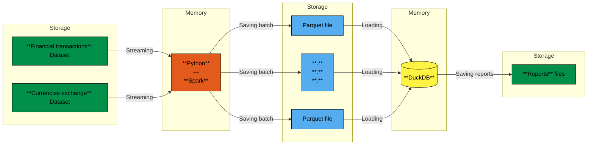

# data-financial

__data-financial__ is an optimized data pipeline designed to process large datasets on modest hardware — _“toasters”_ — using __Spark__.
For this purpose, I selected a dataset of financial transactions (__32 million rows__) and combined it with another dataset containing historical currency exchange rates.
The goal was to perform large-scale operations such as cross joins, partitioning, and other transformations efficiently.

## 🔍​ Schema of the pipeline

## 🚀​ Project Overview

This project leverages PySpark and its lazy evaluation model to process a large dataset of over 32 million financial transactions in batch mode. For each record, the pipeline computes the transaction amount converted into US Dollars (USD) using historical exchange rates.

To handle such a large volume of data on a machine with limited hardware resources, the dataset is split into batches. Each batch is processed sequentially — the results are written to disk before moving to the next batch, allowing memory to be freed efficiently between operations.

At the end of the processing stage, the aggregated results are analyzed using DuckDB, which provides fast, in-memory analytics on the processed data. This combination of PySpark for distributed batch computation and DuckDB for analytical queries ensures both scalability and performance, even on modest hardware.

## 🛠️​ Tech Stack
- Python → Offers great flexibility and simplicity for scripting, making it ideal for building and automating data workflows.
- Apache Spark → Used to handle and process large-scale streaming and batch data efficiently across distributed systems.
- DuckDB → Enables fast in-memory analytics directly on top of Parquet files, allowing high-performance querying without heavy infrastructure.

## 📊​ Benchmark

Context of this benchmark:
- My laptop has the following spec :
  - OS : CachyOS x86_64
  - CPU : 11th Gen Intel(R) Core(TM) i7-1165G7 (8) @ 4.70 GHz
  - GPU: Intel Iris Xe Graphics @ 1.30 GHz [Integrated]
  - Memory : 8 GB of RAM
- Dataset used:
  - One CSV file of 3 GB
  - One CSV file of 5.1 MB
- Final result:
  - 31.90 million rows
  - 8 columns
  - Stored as _Parquet_ files

Performance comparison :

|Ranked|Python module|Mean execution time|Number of partitions|
|:-:|:-:|:-:|:-:|
|1|Dask|~10 minutes|47|
|2|Apache DataFusion|~23 minutes|64|
|3|Apache Spark|~90 minutes|64|

My laptop has limited RAM, and the entire data pipeline runs on a single machine.
In this context, Dask performs better because it introduces less overhead than Spark, especially since Spark relies on the JVM, which is more resource-hungry.

Dask is therefore a better fit for my use case.

## 📚​ Data Sources
I used Datasets from **Kaggle**.

- [IBM Transactions for Anti Money Laundering (AML)](https://www.kaggle.com/datasets/ealtman2019/ibm-transactions-for-anti-money-laundering-aml)
- [Major Currency Exchange Rates](https://www.kaggle.com/datasets/weirdanalyst/currency-exchange-rates-since-2000-01-03)

